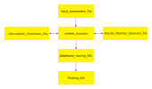

# ⚡ Electro-Thermal Lifetime Assessment for Inverter Semiconductors (IGBTs and Diodes)

A comprehensive **Python-based electro–thermal lifetime modeling framework** for inverter semiconductor devices.  
It quantifies semiconductor degradation and reliability under realistic mission profiles using coupled electrical–thermal modeling and empirical lifetime estimation (LESIT model).

---

## 👤 Author
**Anirudh Katoch**  
PhD Candidate, Technical University of Munich (TUM)  
Chair of Renewable and Sustainable Energy Systems (ENS), CoSES Team  
Supervisor: **Prof. Thomas Hamacher**  
📧 ge26cih@mytum.de  

---

## 🧭 Overview
This framework estimates **IGBT and diode lifetime degradation** in grid-forming and grid-following inverters under various loading and power factor conditions.

The model:
- Computes **electrical losses** (switching and conduction) per cycle.  
- Simulates **thermal behavior** using a Foster RC network.  
- Applies **LESIT-based empirical lifetime models** combined with Miner’s damage accumulation.  
- Includes **Monte Carlo–based uncertainty propagation** for probabilistic reliability estimation.

---

## 🧩 Core Modules
| File | Function |
|------|-----------|
| `Input_parameters_file.py` | Defines all physical, electrical, and thermal input parameters. |
| `Calculation_functions_file.py` | Contains all numerical models — power flow, loss models, lifetime equations. |
| `Electro_thermal_behavior_file.py` | Implements the Foster network for electro–thermal coupling. |
| `mother_function.py` | Orchestrates full workflow — from mission profile to lifetime results. |
| `Dataframe_saving_file.py` | Stores results as structured DataFrames in `/Finished_results/`. |
| `Plotting_file.py` | Generates figures for losses, temperature swings, and life consumption. |

  

*Figure: Conceptual architecture of the electro–thermal lifetime assessment framework showing the coupling between different modules.*

---

## ⚙️ Execution and Usage

### Requirements
- **Python 3.13+**
- Dependencies listed in `requirements.txt`

